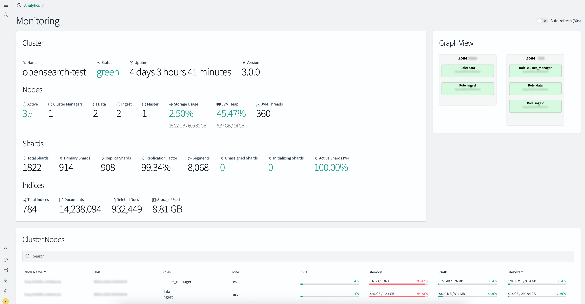

# OpenSearch Dashboards Plugin: monitoring

This repository contains the source code for the **monitoring** plugin for [OpenSearch Dashboards](https://github.com/opensearch-project/OpenSearch-Dashboards).

## Screenshots



## Prerequisites

Before you begin, make sure you have the following installed:

- Node.js (version specified in OpenSearch Dashboards’ `.node-version` file)
- Yarn (`npm install -g yarn`)
- Git

---

## Getting Started

### 1. Clone OpenSearch Dashboards

```bash
git clone https://github.com/opensearch-project/OpenSearch-Dashboards.git
cd OpenSearch-Dashboards
````

### 2. Clone Security Dashboards Plugin (if required)

If your plugin requires the Security plugin, clone it inside the `plugins` directory:

```bash
cd plugins
git clone https://github.com/opensearch-project/security-dashboards-plugin.git
```

### 3. Clone this Plugin

Still within the `plugins` directory:

```bash
git clone THIS_REPO
```

Replace the above URL with your actual plugin repository.

---

## Building the Development Environment

Return to the root of the OpenSearch Dashboards repo and run:

```bash
yarn osd bootstrap
```

This will install dependencies and bootstrap all plugins.

---

## Running the Plugin in Development Mode

To start the development environment and test your plugin:

```bash
yarn start
```

This will start OpenSearch Dashboards with your plugin enabled.

---

## Building the Plugin for Production

To generate a distributable version of your plugin:

```bash
cd plugins/your-plugin-repo
yarn plugin-helpers build
```

The build output will be located in the `build/` directory.

---

## Configuration

Add the following configuration to your `config/opensearch_dashboards.yml` (not mandatory):

```yaml
monitoring:
  nodes: ["NODE1_FQDN", "NODE2_FQDN", "NODE3_FQDN", ...]
```

## Required permissions

- cluster:monitor/health
- cluster:monitor/nodes/stats
- cluster:monitor/stats
- indices:monitor/recovery

---

## Installation

On OpenSearch Dashboards server:

```bash
/usr/share/opensearch-dashboards/bin/opensearch-dashboards-plugin install file://ZIP_FILE_PATH --allow-root
systemctl restart opensearch-dashboards.service
```

To remove the plugin:

Remove `monitoring` entry in `config/opensearch_dashboards.yml` before removing the plugin.

```bash
/usr/share/opensearch-dashboards/bin/opensearch-dashboards-plugin remove monitoring --allow-root
systemctl restart opensearch-dashboards.service
```
