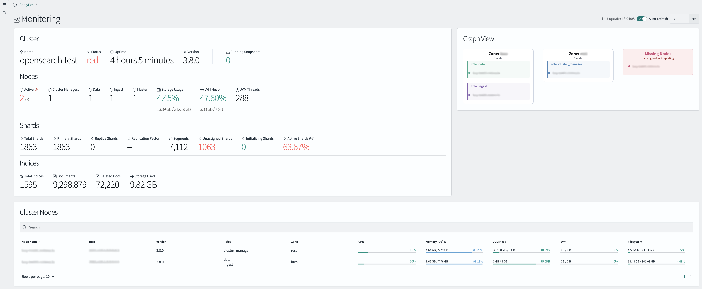

# OpenSearch Dashboards Plugin: monitoring

This repository contains the source code for the **monitoring** plugin for [OpenSearch Dashboards](https://github.com/opensearch-project/OpenSearch-Dashboards).

It gives cluster operators an at-a-glance view of cluster health, node resource usage, shard state, snapshots, and cluster topology, without leaving OpenSearch Dashboards.

## Screenshots



## Features

- **Cluster overview** — name, status, uptime, version, and running snapshot count at a glance.
- **Node stats** — active/cluster-manager/data/ingest/master node counts, storage usage, JVM heap, and JVM thread count, with a tooltip on OS memory explaining why it commonly reads near 100% on a healthy node (Linux page cache) and pointing at JVM heap as the more actionable signal.
- **Cluster Nodes table** — per-node CPU, memory (OS + JVM heap), swap, filesystem, and version, sortable and searchable.
- **Graph View** — cluster topology grouped by zone and role, with a dedicated card for nodes that are configured but not currently reporting. Column count adapts to window width automatically, so it stays readable whether there are 2 zones or 20.
- **Shards, Indices, Recovery, and Snapshots** views, all with color-coded status.
- All status/threshold colors are sourced from OpenSearch Dashboards' own default palette (`euiPaletteForStatus`, `euiPaletteColorBlind`, `euiPaletteGray`) rather than hardcoded values, so the plugin stays visually consistent with the rest of OSD and with whatever the platform's default palette becomes in the future.

## Prerequisites

Before you begin, make sure you have the following installed:

- Node.js (version specified in OpenSearch Dashboards' `.node-version` file)
- Yarn Classic 1.x (`corepack enable` is the easiest way to get the exact pinned version — see below)
- Git

---

## Getting Started (full dev environment)

Use this if you want to run OpenSearch Dashboards itself in development mode with this plugin loaded — for example, to iterate on changes with hot reload.

### 1. Clone OpenSearch Dashboards

```bash
git clone https://github.com/opensearch-project/OpenSearch-Dashboards.git
cd OpenSearch-Dashboards
```

Use the branch/tag matching the version in `opensearch_dashboards.json` if you're targeting a different release.

### 2. Clone Security Dashboards Plugin (if required)

If your cluster has the Security plugin enabled, clone it inside the `plugins` directory:

```bash
cd plugins
git clone https://github.com/opensearch-project/security-dashboards-plugin.git
cd ..
```

### 3. Clone this Plugin

Still within the `plugins` directory:

```bash
cd plugins
git clone https://github.com/Psych0meter/opensearch-dashboards-plugin-monitoring.git monitoring
cd ..
```

### 4. Bootstrap

From the root of the OpenSearch Dashboards repo:

```bash
node -v   # check it satisfies the range in package.json "engines" - if not, see the
          # Node.js version fix in the Manual Release Build section below
yarn osd bootstrap
```

This installs dependencies and bootstraps every plugin, including this one.

### 5. Run

```bash
yarn start
```

This starts OpenSearch Dashboards with the plugin enabled, with hot reload for plugin changes.

---

## Manual Release Build (CLI, no CI)

Use this when you just want a distributable `.zip` of the plugin — for example, to install it on a server, or to test a release build locally before tagging. This mirrors the steps the project's GitHub Actions release workflow runs, so the artifact you get here is the same one that workflow would produce.

```bash
# From inside your clone of this plugin repo
PLUGIN_DIR="$(pwd)"
OSD_VER=$(jq -r '.opensearchDashboardsVersion' opensearch_dashboards.json)   # e.g. "3.8.0"

# 1) Shallow-clone OpenSearch Dashboards at that version, as a sibling directory
cd ..
git clone --depth 1 --branch "$OSD_VER" \
  https://github.com/opensearch-project/OpenSearch-Dashboards.git
cd OpenSearch-Dashboards

# 2) Match Node + Yarn to what this OSD version expects
node -v                                     # check it satisfies the range in package.json "engines"

# If it doesn't, install the exact version via nvm (installs nvm itself if it's not already present):
export NVM_DIR="$HOME/.nvm"
if [ ! -s "$NVM_DIR/nvm.sh" ]; then
  curl -o- https://raw.githubusercontent.com/nvm-sh/nvm/v0.40.7/install.sh | bash
fi
\. "$NVM_DIR/nvm.sh"
nvm install "$(cat .node-version)"
nvm use "$(cat .node-version)"
node -v                                     # should now match .node-version
corepack enable
corepack prepare yarn@1.22.19 --activate    # OSD pins Yarn Classic via "packageManager"

# 3) Copy the plugin into place
mkdir -p plugins
rsync -a --delete "$PLUGIN_DIR"/ plugins/monitoring/ --exclude .git

# 4) Bootstrap, scoped to this plugin
CHROMEDRIVER_SKIP_DOWNLOAD=true \
CYPRESS_INSTALL_BINARY=0 \
PUPPETEER_SKIP_DOWNLOAD=true \
yarn osd bootstrap --scope monitoring

# 5) Build
cd plugins/monitoring
yarn plugin-helpers build
```

The zip is written to `plugins/monitoring/build/monitoringPlugin-$OSD_VER.zip`.

After building, re-run step 3 (`rsync`) to pick up further changes and re-run step 5 — steps 1-2 and the bootstrap in step 4 only need to be done once per OSD checkout.

**Useful `plugin-helpers build` flags:**

| Flag | Effect |
| --- | --- |
| `--skip-archive` | Build the unpacked plugin directory only, skip zipping — faster when iterating locally. |
| `-k <version>`, `--opensearch-dashboards-version <version>` | Override the OSD version baked into the output filename, without editing `opensearch_dashboards.json`. |

**If you're running as root** (uncommon outside custom containers), `yarn osd bootstrap` will fail with `OpenSearch Dashboards should not be run as root. Use --allow-root to continue.` — this step doesn't expose that flag through `--scope`, so the practical fix is to build as a non-root user instead.

---

## Configuration

No plugin-specific configuration is required. The "missing nodes" detection in Graph View and the Nodes stat is derived automatically from `opensearch.hosts` in your `config/opensearch_dashboards.yml` — whatever hosts OSD is already configured to talk to are treated as the expected node inventory:

```yaml
opensearch:
  hosts: ["https://NODE1_FQDN:9200", "https://NODE2_FQDN:9200", "https://NODE3_FQDN:9200", ...]
```

> **Note:** versions prior to 1.1.1 required a separate `monitoring.nodes` entry. That key is deprecated (the plugin logs a warning at startup if it's still set) and can be removed — it's no longer read.

## Required permissions

- cluster:admin/snapshot/status
- cluster:monitor/health
- cluster:monitor/nodes/info
- cluster:monitor/nodes/stats
- cluster:monitor/stats
- indices:monitor/recovery

---

## Installation

On the OpenSearch Dashboards server:

```bash
/usr/share/opensearch-dashboards/bin/opensearch-dashboards-plugin install file://ZIP_FILE_PATH --allow-root
systemctl restart opensearch-dashboards.service
```

To remove the plugin:

```bash
/usr/share/opensearch-dashboards/bin/opensearch-dashboards-plugin remove monitoring --allow-root
systemctl restart opensearch-dashboards.service
```
